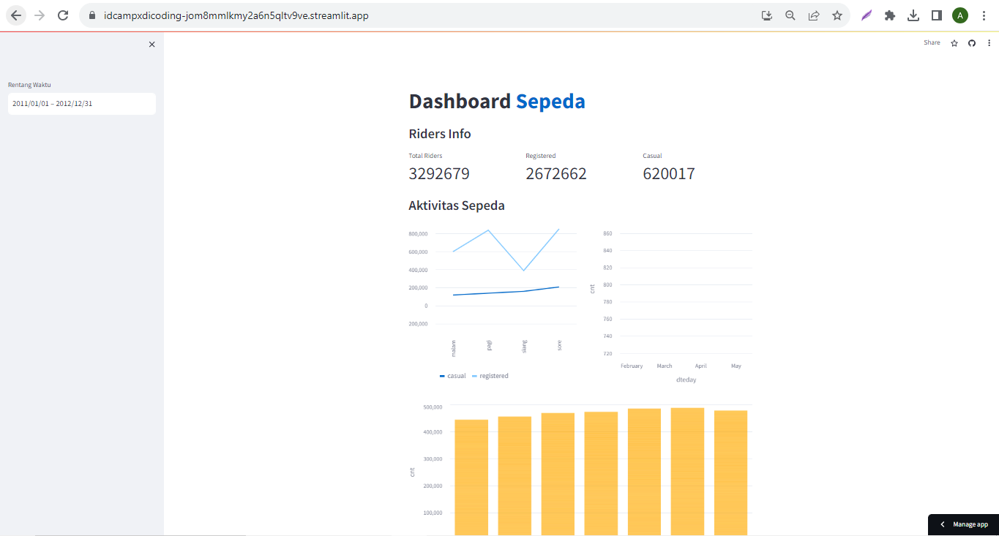

# IDcampxDicoding

## Setup environment

```
conda create --name main-ds python=3.9
conda activate main-ds
pip install numpy pandas scipy matplotlib seaborn jupyter streamlit babel
```

## Run Streamlit

```
streamlit run dashboard/streamlit_app.py

```

Tautan untuk dashboard (streamlitCloud)

```
https://idcampxdicoding-jom8mmlkmy2a6n5qltv9ve.streamlit.app/
```


